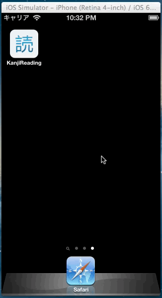

## KanjiReading for iOS

## Code Status

* 

## Special Thanks

* [iPhone-Zinnia](https://github.com/FLCLjp/iPhone-Zinnia)
* [Zinnia](http://zinnia.sourceforge.net)
* [cjkvi-tables](https://github.com/cjkvi/cjkvi-tables)

## License

KanjiReading is released under the [MIT License](http://www.opensource.org/licenses/MIT).
